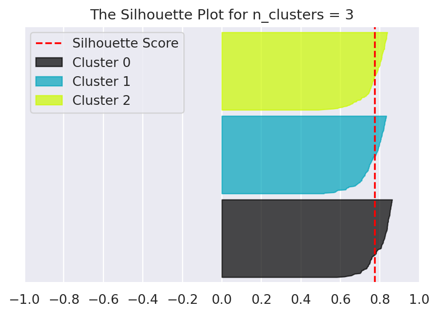

### Stuff this article aims to cover

* KMeans
* Silhouette Score
* Marketing Segmentation


# Introduction

What is clustering? Clustering is a category of unsupervised machine learning models.

What is unsupervised learning then? Unsupervised learning is a class of algorithms that take a dataset of unlabeled examples and for each feature vector **x** as input either transforms it into another vector or into a value that can be used to solve a practical problem. For example, in **clustering** this useful value is the id of the cluster.

In other words, clustering algorithms seek to learn, from the properties of the data, an optimal division or discrete labeling of groups of points. There are a lot of clustering algorithms already implemented in libraries such as **scikit-learn** and others, so no need to worry about that part. One of the simplest to understand clustering algorithms is **KMeans**.


# KMeans

The **KMeans** algorithm searches for *k* number of clusters (the number *k* must be known in advance) within an unlabeled multidimensional dataset. For the **KMeans** algorithm the optimal clustering has the following properties:
    
* The "cluster center" is the arithmetic mean of all the points belonging to the cluster
* Each point is closer to its own cluster center than to other cluster centers

**KMeans** is implemented in **sklearn.cluster.KMeans**, so let's generate a two dimensional sample dataset and observe the k-means results.

```py
import matplotlib.pyplot as plt
import seaborn as sns; sns.set()
from sklearn.datasets import make_blobs

X, _ = make_blobs(n_samples=420, centers=3, cluster_std=0.40, random_state=0)
plt.scatter(X[ : , 0], X[ : , 1], s=15)
```


Now, let's apply **KMeans** on this sample dataset. We will visualize the results by coloring each cluster using a different color. We will also plot the cluster centers.

```py
from sklearn.cluster import KMeans

kmeans = KMeans(n_clusters=3)
kmeans.fit(X)
ids = kmeans.predict(X)

plt.scatter(X[ : , 0], X[ : , 1], c=ids, s=15, cmap='viridis')
centers = kmeans.cluster_centers_
plt.scatter(centers[ : , 0], centers[ : , 1], c='red', s=100, alpha=0.5)
```


As you can see the algorithm assigns the points to the clusters very similarly to how we might assign them by eye.

How does the algorithm work? **KMeans** uses an iterative approach known as *expectation–maximization*. In the context of the **KMeans** algorithm, the *expectation–maximization* consists of the following steps:

1. Randomly guess some cluster centers
2. Repeat until converged
    <ol type='a'>
        <li><i>E-Step</i>: assign points to the nearest cluster center</li>
        <li><i>M-Step</i>: set the cluster centers to the mean</li>
    </ol>

The **KMeans** algorithm is simple enough for us to write a really basic implementation of it in just a few lines of code.

```py
# This function has the following 
# Signature: pairwise_distances_argmin(X, Y, axis=1, metric='euclidean', metric_kwargs=None)
# This function computes for each row in X, the index of the row of Y which
# is closest (according to the specified distance).
from sklearn.metrics import pairwise_distances_argmin
import numpy as np

def find_clusters(X, n_clusters, rseed=69):
    # Randomly guess some cluster centers
    rng = np.random.RandomState(rseed)
    i = rng.permutation(X.shape[0])[ : n_clusters]
    centers = X[i]
    
    while True:
        # E-Step: Assign labels based on closest center
        labels = pairwise_distances_argmin(X, centers)
        
        # M-Step: Find new centers from means of points
        new_centers = np.array([
            X[labels == i].mean(0) for i in range(n_clusters)
        ])
        
        # Check for convergence
        if np.all(centers == new_centers): 
            break
        
        centers = new_centers
        
    return centers, labels
```

Well tested implementations, such as the one from scikit-learn, do a few more things under the hood, but this trivial implementation allows us to view one caveat of expectation-maximization.

Let's test this implementation on our sample dataset.

```py
centers, labels = find_clusters(X, 3)
plt.scatter(X[:, 0], X[:, 1], c=labels, s=15, cmap='viridis')
plt.scatter(centers[ : , 0], centers[ : , 1], c='red', s=100, alpha=0.5)
```


Everything seems to be ok, right? Now, let's try and change the random seed.

```py
centers, labels = find_clusters(X, 3, rseed=5)
plt.scatter(X[:, 0], X[:, 1], c=labels, s=15, cmap='viridis')
plt.scatter(centers[ : , 0], centers[ : , 1], c='red', s=100, alpha=0.5)
```


What happened??? Well, there are a few issues to be aware of when using the expectation-maximization approach. One of them is that the globally optimal result may not be achieved. Although the E–M procedure is guaranteed to improve the result in each step, there is no assurance that this will lead to the globally optimal result. This is why, better implementations, such as the one from Scikit-Learn, by default run the algorithm for multiple starting guesses. (In Scikit-Learn this is controlled by the **n_init** parameter, which defaults to 10)

<!-- k-means is limited to linear cluster boundaries... -->
Another caveat of the **KMeans** algorithm is that it is limited to linear cluster boundaries. The fundamental assumption that points will be closer to their own cluster center than to others means that the algorithm will often be ineffective when dealing with clusters that have complicated geometries. Consider the following example, along with the results found by the typical **KMeans** approach. 

```py
from sklearn.datasets import make_moons

X, _ = make_moons(500, noise=.06, random_state=69)
labels = KMeans(2, random_state=69).fit_predict(X)
plt.scatter(X[:, 0], X[:, 1], c=labels, s=15, cmap='viridis')
```


Fortunately, this issue is easily solved using one version of kernelized **KMeans** that is implemented in Scikit-Learn within the **SpectralClustering** estimator.

```py
from sklearn.cluster import SpectralClustering

model = SpectralClustering(n_clusters=2, affinity='nearest_neighbors', assign_labels='kmeans')
labels = model.fit_predict(X)
plt.scatter(X[:, 0], X[:, 1], c=labels, s=15, cmap='viridis')
```


<!-- k-means can be slow for large numbers of samples -->
<!-- k-means is limited to linear cluster boundaries -->

Other problems that you might have to deal with when using the **KMeans** algorithm are
* **KMeans** might be slow for large number of samples. Because each iteration of the **KMeans** algorithm must access every point in the dataset, the algorithm might become relatively slow as the number of samples grows. Some sort of fix for this issue might be using just a subset of the data to update the cluster centers at each step.
* The number of clusters must be selected beforehand. This is a common challenge because **KMeans** cannot learn the number of clusters from the data. For example, we can ask the algorithm to identify 4 clusters from our previous sample dataset and it will proceed without a second thought.

```py
labels = KMeans(4, random_state=420).fit_predict(X)
plt.scatter(X[:, 0], X[:, 1], c=labels, s=15, cmap='viridis')
```


Whether this is a meaningful result or not is a question that might depend on the context. Some well known approaches that might help when picking the right number of clusters are the **elbow method** (a heuristic approach that we won't discuss in this article) and the **Silhouette Score** about which we will continue the discussion.

# Silhouette Score

**Silhouette analysis** can be used to study the separation distance between the resulting clusters. The silhouette plot displays a measure of how close each point in one cluster is to points in the neighboring clusters and thus provides a way to assess parameters like number of clusters visually. This measure has a range of [-1, 1].

**Silhouette coefficients** (as these values are referred to as) near +1 indicate that the sample is far away from the neighboring clusters. A value of 0 indicates that the sample is on or very close to the decision boundary between two neighboring clusters and negative values indicate that those samples might have been assigned to the wrong cluster.

**The Silhouette Coefficient** is calculated using the mean intra-cluster distance (a) and the mean nearest-cluster distance (b) for each sample. **The Silhouette Coefficient** for a sample is (b - a) / max(a, b). To clarify, b is the distance between a sample and the nearest cluster that the sample is not a part of. Note that Silhouette Coefficient is only defined if number of labels is 2 <= n_labels <= n_samples - 1.

In scikit-learn there is **sklearn.metrics.silhouette_score** that is used to compute the **mean Silhouette Coefficient** of all samples and there also is **sklearn.metrics.silhouette_samples** that computes the **Silhouette Coefficient** for each sample.

Now let's put the newly acquired knowledge in practice and write a function that shows the **Silhouette Plot** for a certain number of clusters.

```py
from sklearn.metrics import silhouette_score, silhouette_samples
import matplotlib.cm as cm

def draw_silhouette_plot(X, n_clusters):
    clusterer = KMeans(n_clusters=n_clusters, random_state=69)
    cluster_labels = clusterer.fit_predict(X)

    silhouette_avg = silhouette_score(X, cluster_labels)
    # Compute the silhouette scores for each sample
    sample_silhouette_values = silhouette_samples(X, cluster_labels)

    # The Silhouette Score ranges from -1 to 1
    plt.xlim([-1, 1])
    # The (n_clusters + 1) * 10 is for inserting blank space between silhouette
    # plots of individual clusters, to demarcate them clearly.
    plt.ylim([0, len(X) + (n_clusters + 1) * 10])
    plt.yticks([]) # Clear the yaxis labels
    plt.xticks([-1, -0.8, -0.6, -0.4, -0.2, 0, 0.2, 0.4, 0.6, 0.8, 1])

    y_lower = 10
    for i in range(n_clusters):
        ith_cluster_silhouette_values = sample_silhouette_values[
            cluster_labels == i
        ]
        ith_cluster_silhouette_values.sort()
        size_cluster_i = ith_cluster_silhouette_values.shape[0]
        y_upper = y_lower + size_cluster_i

        color = cm.nipy_spectral(float(i) / n_clusters)
        plt.fill_betweenx(np.arange(y_lower, y_upper),
                            0, ith_cluster_silhouette_values,
                            facecolor=color, edgecolor=color, alpha=0.7)

        # Compute the new y_lower for next plot
        y_lower = y_upper + 10  # 10 for the 0 samples

    # The vertical line for the average silhouette score of all the values
    plt.axvline(x=silhouette_avg, color="red", linestyle="--")
    plt.title(f'The Silhouette Plot for n_clusters = {n_clusters}')
    plt.legend(
        [ 'Silhouette Score' ] + [f'Cluster {i}' for i in range(n_clusters)]
    )


draw_silhouette_plot(X, int(input('Enter the number of clusters: ')))
```





As you can see the best number of clusters judging by the **average Silhouette Score** is 3. Furthermore, these plots provide more valuable information than you might expect. They provide information about the size of each cluster relative to other clusters and they also provide information about the approximate **Silhouette Coefficient** for each sample in the cluster.


# Marketing Segmentation

In the context of **Marketing Segmentation**, also known as **Customer Segmentation**, **Cluster Analysis** involves the use of a mathematical model to discover groups of similar customers based on finding the smallest variations among customers within each group. These homogeneous groups are known as **customer archetypes** or **personas**.

For the following example, we will use some data from the [kaggle](https://www.kaggle.com) website.

The CSV file can be downloaded from [here](https://www.kaggle.com/vjchoudhary7/customer-segmentation-tutorial-in-python) or by using the kaggle CLI with the following command

```bash
kaggle datasets download --unzip -d vjchoudhary7/customer-segmentation-tutorial-in-python
```

First of all, let's import the data using **pandas.read_csv** and do a little preprocessing.

```py
import pandas as pd
from sklearn import preprocessing

df = pd.read_csv('Mall_Customers.csv')
df.drop('CustomerID', axis=1, inplace=True)

df.loc[df['Gender'] == 'Male', 'Gender'] = 0
df.loc[df['Gender'] == 'Female', 'Gender'] = 1

column_names = df.columns
# Standardize features by removing the mean and scaling to unit variance
scaler = preprocessing.StandardScaler()
X = scaler.fit_transform(df)
```

Note that we standardize the data before applying the clustering algorithm. This is a good practice and although sometimes this step is not required, it rarely hurts to do it.

Now, let's use the function that we defined previously in order to perform **Silhouette Analysis** and find the best number of clusters.

```py
from pylab import figure
for i, k in enumerate([2, 3, 4]):
    figure(i)
    draw_silhouette_plot(X, k)
```


Based on these plots, the best number of clusters seems to be 4 because
* it has the biggest **Silhouette Score**
* the clusters are relatively of equal sizes
* it does not have samples with negative **Silhouette Coefficients**

Now, let's go a step further and see what the cluster centers look like for each of the clusters and see if we can divide the customers from this dataset into distinct **customer archetypes**.

```py
kmeans = KMeans(n_clusters=4, random_state=69).fit(X)

# Reverse the Standard Scaling we did earlier
centers = scaler.inverse_transform(kmeans.cluster_centers_)

# View the cluster centers as a pandas table
pd.DataFrame(
    data=centers,
    index=[ f'K{i}' for i in range(1, centers.shape[0] + 1) ],
    columns=column_names
)
```


So, based on the cluster centers we can define 4 **customer archetypes**
* Younger Males with High Spending Score
* Older Males with Low Spending Score
* Younger Females with High Spending Score
* Older Females with Low Spending Score