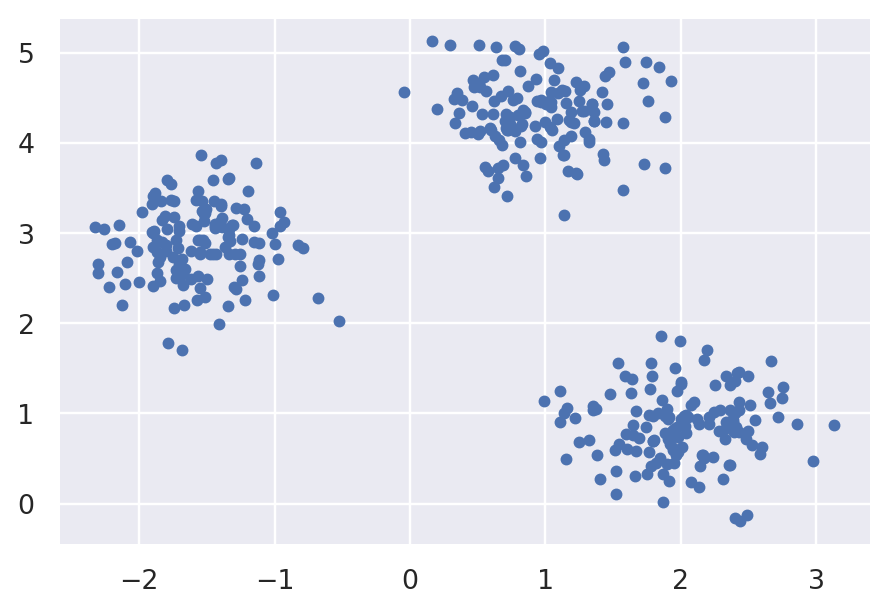
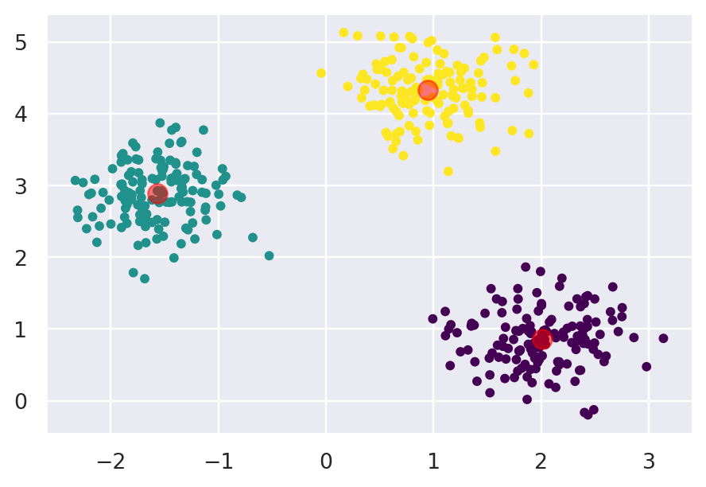

### Stuff this article aims to cover

* KMeans
* Silhouette Score
* Marketing Segmentation


# Introduction

What is clustering? Clustering is a category of unsupervised machine learning models.

What is unsupervised learning then? Unsupervised learning is a class of algorithms that take a dataset of unlabeled examples and for each feature vector **x** as input either transforms it into another vector or into a value that can be used to solve a practical problem. For example, in **clustering** this useful value is the id of the cluster.

In other words, clustering algorithms seek to learn, from the properties of the data, an optimal division or discrete labeling of groups of points. There are a lot of clustering algorithms already implemented in libraries such as **scikit-learn** and others, so no need to worry about that part. One of the simplest to understand clustering algorithms is **KMeans**.


# KMeans

The **KMeans** algorithm searches for *k* number of clusters (the number *k* must be known in advance) within an unlabeled multidimensional dataset. For the **KMeans** algorithm the optimal clustering has the following properties:
    
* The "cluster center" is the arithmetic mean of all the points belonging to the cluster
* Each point is closer to its own cluster center than to other cluster centers

**KMeans** is implemented in **sklearn.cluster.KMeans**, so let's generate a two dimensional sample dataset and observe the k-means results.

```py
import matplotlib.pyplot as plt
import seaborn as sns; sns.set()
from sklearn.datasets import make_blobs

X, _ = make_blobs(n_samples=420, centers=3, cluster_std=0.40, random_state=0)
plt.scatter(X[ : , 0], X[ : , 1], s=15)
```




Now, let's apply **KMeans** on this sample dataset. We will visualize the results by coloring each cluster using a different color. We will also plot the cluster centers.

```py
from sklearn.cluster import KMeans

kmeans = KMeans(n_clusters=3)
kmeans.fit(X)
ids = kmeans.predict(X)

plt.scatter(X[ : , 0], X[ : , 1], c=ids, s=15, cmap='viridis')
centers = kmeans.cluster_centers_
plt.scatter(centers[ : , 0], centers[ : , 1], c='red', s=100, alpha=0.5)
```


As you can see the algorithm assigns the points to the clusters very similarly to how we might assign them by eye.

How does the algorithm work? **KMeans** uses an iterative approach known as *expectation–maximization*. In the context of the **KMeans** algorithm, the *expectation–maximization* consists of the following steps:

1. Randomly guess some cluster centers
2. Repeat until converged
    <ol type='a'>
        <li><i>E-Step</i>: assign points to the nearest cluster center</li>
        <li><i>M-Step</i>: set the cluster centers to the mean</li>
    </ol>

The **KMeans** algorithm is simple enough for us to write a really basic implementation of it in just a few lines of code.

```py
# This function has the following 
# Signature: pairwise_distances_argmin(X, Y, axis=1, metric='euclidean', metric_kwargs=None)
# This function computes for each row in X, the index of the row of Y which
# is closest (according to the specified distance).
from sklearn.metrics import pairwise_distances_argmin
import numpy as np

def find_clusters(X, n_clusters, rseed=69):
    # Randomly guess some cluster centers
    rng = np.random.RandomState(rseed)
    i = rng.permutation(X.shape[0])[ : n_clusters]
    centers = X[i]
    
    while True:
        # E-Step: Assign labels based on closest center
        labels = pairwise_distances_argmin(X, centers)
        
        # M-Step: Find new centers from means of points
        new_centers = np.array([
            X[labels == i].mean(0) for i in range(n_clusters)
        ])
        
        # Check for convergence
        if np.all(centers == new_centers): 
            break
        
        centers = new_centers
        
    return centers, labels
```

Well tested implementations, such as the one from scikit-learn, do a few more things under the hood, but this trivial implementation allows us to view one caveat of expectation-maximization.

Let's test this implementation on our sample dataset.

```py
centers, labels = find_clusters(X, 3)
plt.scatter(X[:, 0], X[:, 1], c=labels, s=15, cmap='viridis')
plt.scatter(centers[ : , 0], centers[ : , 1], c='red', s=100, alpha=0.5)
```



Everything seems to be ok, right? Now, let's try and change the random seed.

```py
centers, labels = find_clusters(X, 3, rseed=5)
plt.scatter(X[:, 0], X[:, 1], c=labels, s=15, cmap='viridis')
plt.scatter(centers[ : , 0], centers[ : , 1], c='red', s=100, alpha=0.5)
```


What happened??? Well, there are a few issues to be aware of when using the expectation-maximization approach. One of them is that the globally optimal result may not be achieved. Although the E–M procedure is guaranteed to improve the result in each step, there is no assurance that this will lead to the globally optimal result. This is why, better implementations, such as the one from Scikit-Learn, by default run the algorithm for multiple starting guesses. (In Scikit-Learn this is controlled by the **n_init** parameter, which defaults to 10)